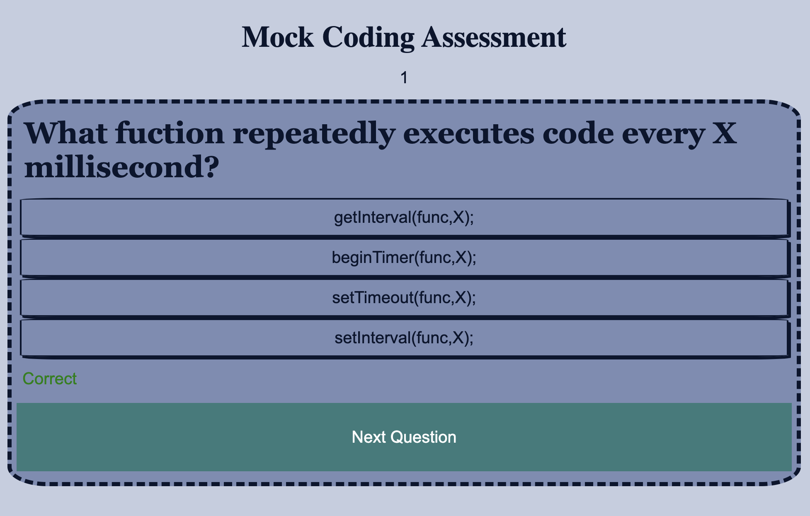

# java-quiz
Quiz on JavaScript - UCB Challenge 4

## Description

UCB Module 4 Challenge. Mock JavaScript timed coding assessment built from scratch. 

## Installation

N/A

## Usage

This page is live at GitHub pages launched by user malxxy.
 
Link to live webpage: https://malxxy.github.io/java-quiz/ 
 
Link to GitHub repository: https://github.com/malxxy/java-quiz.git 
 
Link to GitHub profile: https://github.com/malxxy 
 

Start page:

 
Question 1:

 
Question 2:

 
Question 3:

 
Game Over:

 
Window Prompt:

 
## Credits

No collaborators.

## License

N/A